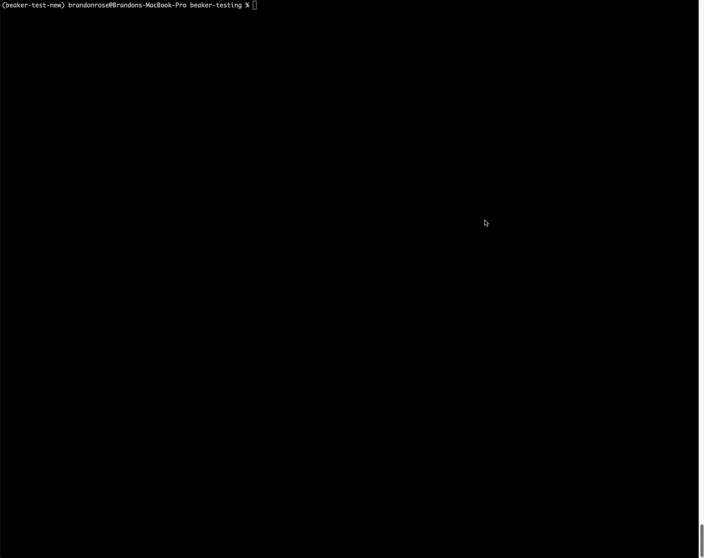

# Creating a New Context

We've tried to make creating a new context as easy as possible by providing some helper utilities in the Beaker CLI for context management. First, you can list the available contexts with `beaker context list`. You should see the default context that comes pre-installed with Beaker.

Next, ensure you have [`hatchling`](https://hatch.pypa.io/latest/). You can do this with `pip install hatch`. Now you're ready to create your `hatch` project with `hatch new customcontext` where `customcontext` is the name of your new context. This will create a new directory with the name of your context and a basic template to get you started. 

From there, navigate to this new directory with `cd customcontext` and you'll see a few files and directories created for you. You are ready to use Beaker's context builder to create a context template. To do this, simply run `beaker context new`. This will step you through a few prompts to help build out your context. 

<div align="center">
    
</div>

Once that is completed, you'll notice a new `src` directory. Overall, your project should have the following structure:

```
customcontext/
├── LICENSE.txt
├── README.md
├── pyproject.toml
├── src/
│   ├── customcontext/
│   │   ├── __init__.py
│   │   ├── __about__.py
│   │   └── customcontext/
│   │       ├── __init__.py
│   │       ├── agent.py
│   │       └── context.py
├── tests/
```

From here on out, your work is to customize the `agent.py` and `context.py` files to meet your needs. Once you're ready to give it a shot, you can run `pip install -e .` to install your context in development mode. Note that if you're using an environment without `beaker-kernel` installed you'll need to add it to the `pyproject.toml` file. 