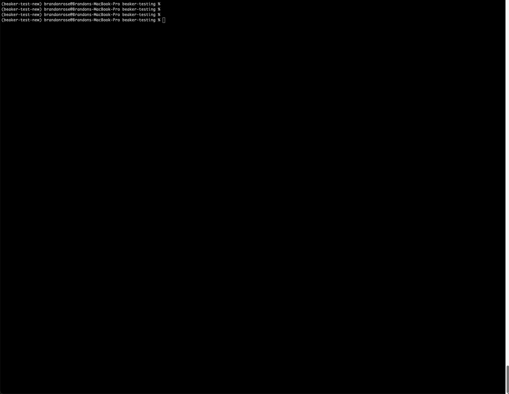
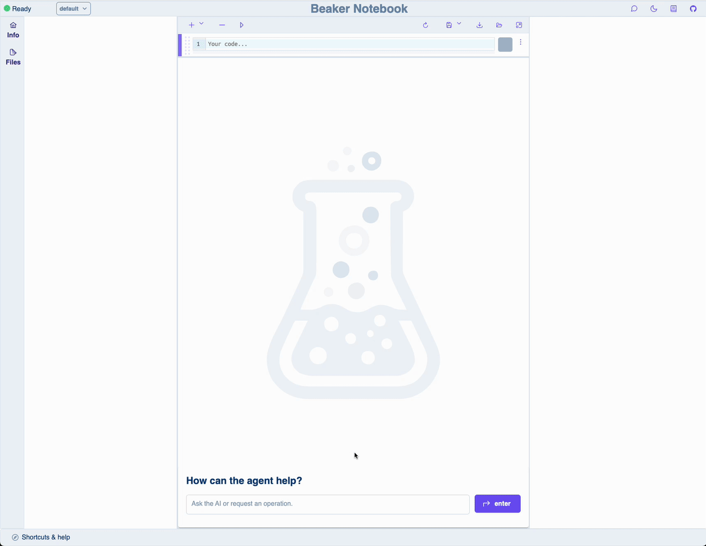
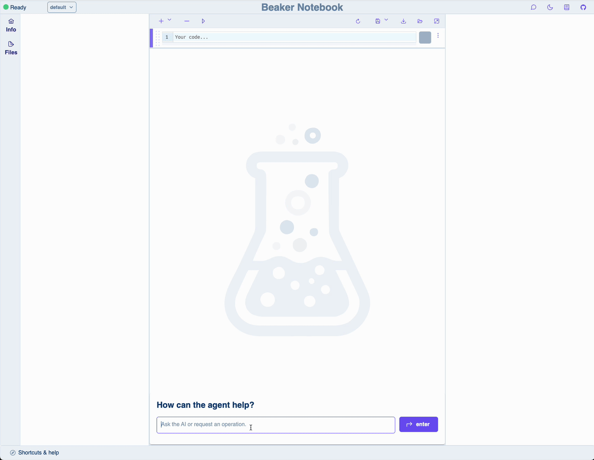
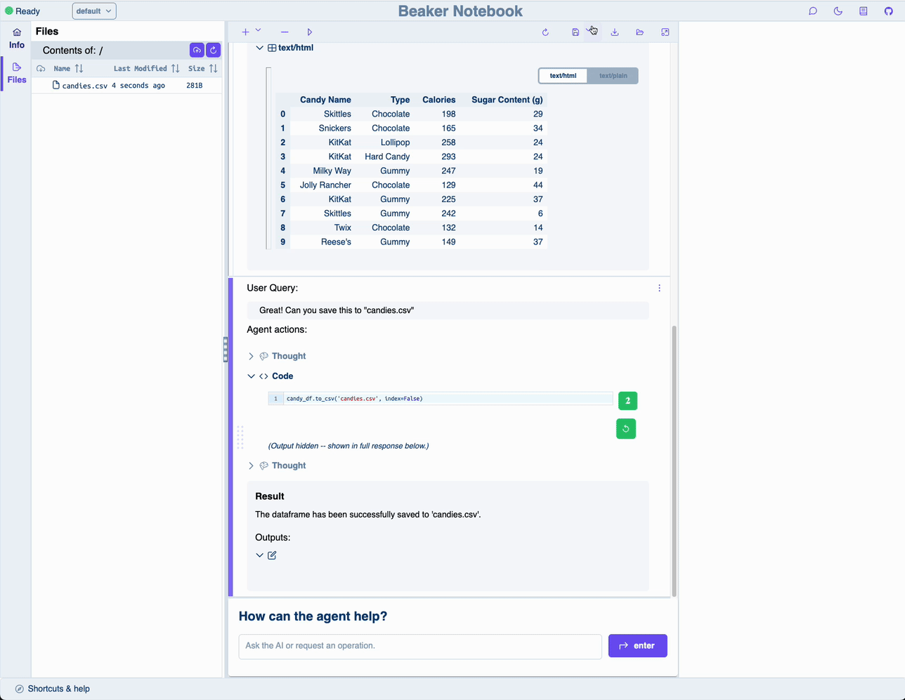
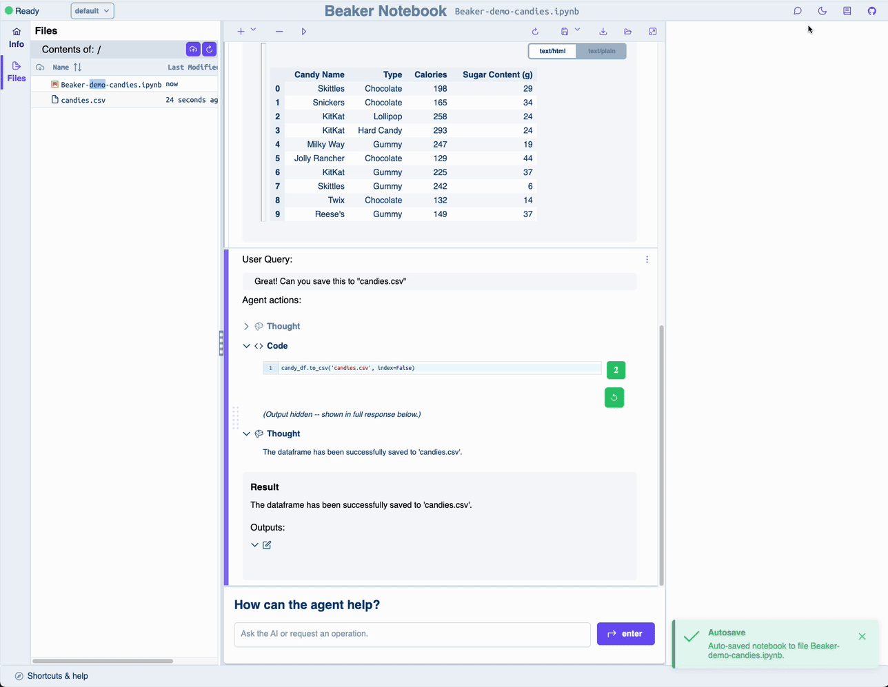
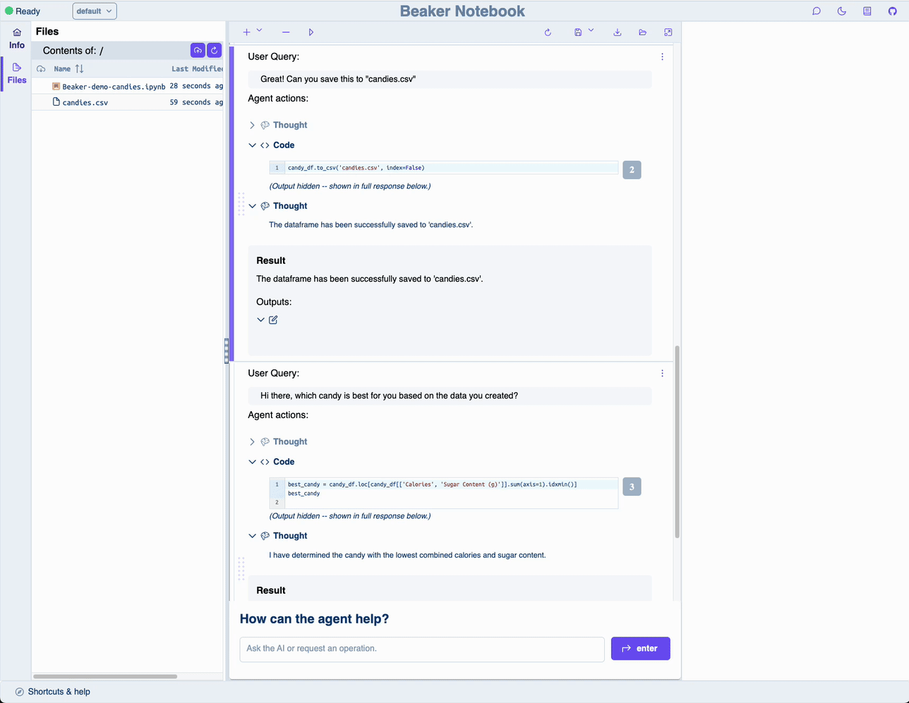

# Getting Started

There are a few things to know when getting started with Beaker. Let's run through them quickly:

- [Setup and running your first notebook](#setup-and-running-your-first-notebook)
- [Beaker as a drop in replacement for Jupyter](#beaker-as-a-drop-in-replacement-for-jupyter)
- [Beaker file system browser](#beaker-file-system-browser)
- [Saving and loading Beaker notebooks](#saving-and-loading-beaker-notebooks)
- [Navigation between chat and coding interfaces](#navigation-between-chat-and-coding-interfaces)
- [Setting the context](#setting-the-context)

## Setup and running your first notebook

Once you've installed Beaker, you should ensure you're config is ready by running `beaker config update`. At minimum, you'll need to provide your OpenAI API key. The rest of the config can be left _as is_ for now. Then just run `beaker notebook` and navigate to [`localhost:8000`](http://localhost:8000) in your browser.

    

## Beaker as a drop in replacement for Jupyter

Beaker truly is designed to be a drop-in replacement for Jupyter notebooks. The core functionality is identical--you can run code cells, you can edit code cells, you can add new code cells, etc. The only difference is that you have a conversational agent at your fingertips to help you write code and explore data. We've worked hard to achieve parity with Jupyter, including using the same keybindings and a similar UIs for the coding interface. 

    

## Beaker file system browser

Beaker has a built in file system browser that lets you navigate the file system and upload and download files. You can access the file system browser by clicking the `Files` icon in the sidebar. 

    

## Saving and loading Beaker notebooks

Beaker notebooks are easy to save and load. You can save a notebook by clicking the `Save` button in the top bar. You can double click on a notebook in the file browser to load it. And of course, notebooks are exported to `.ipynb` format so you can use them in any other Jupyter-compatible environment.

    

## Navigation between chat and coding interfaces

It's easy to hop between the chat interface and the coding interface. You can access the chat interface by clicking the `Chat` icon in the top menu. You can also use that menu to swap between light and dark themes.

    

## Setting the context

If you're using a custom context you'll want to make sure it's set as the current context. To do that, click the dropdown menu in the top left of the coding interface. If you're in the chat interface click the green button on the left hand side.

    

